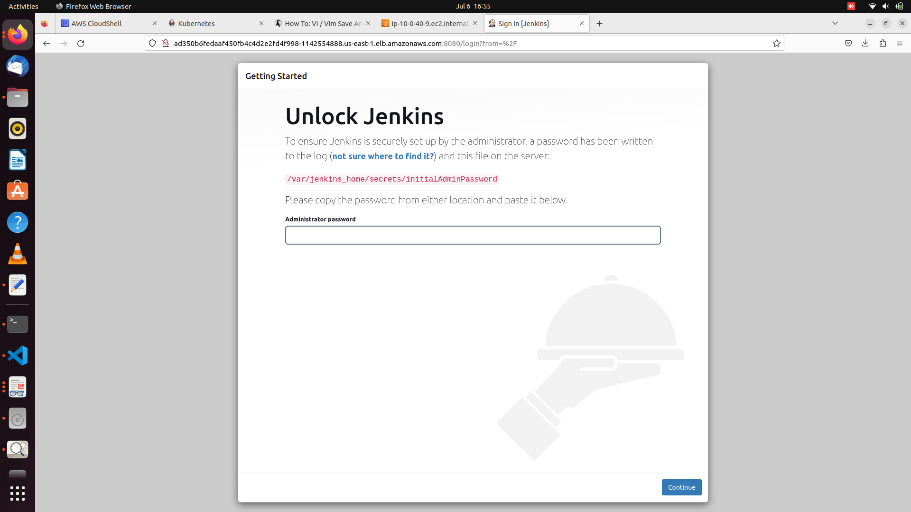

# Deploy jenkins on private eks cluster 

 
 

1. create infrastructure   

2. install jenkins on the cluster use this link (https://www.jenkins.io/doc/book/installing/kubernetes/)   

2.1 to expose jenkins create loadbalancer service using command 

 $ kubectl expose deployment <deployment name> --type=LoadBalancer --name=my-service   

Use this link (https://kubernetes.io/docs/tutorials/stateless-application/expose-external-ip-address/)   

 